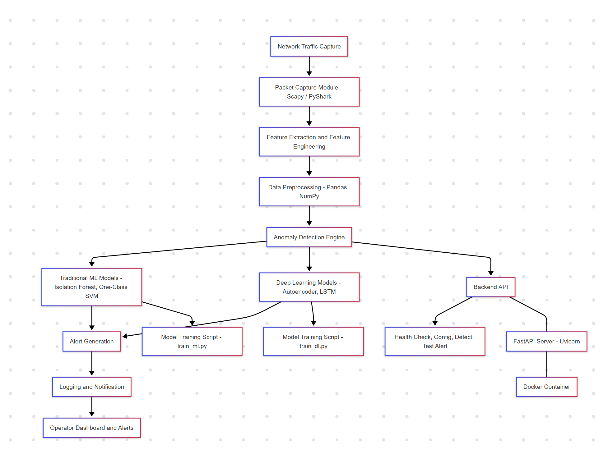

## Overview

**NetAnomaly** is a real-time backend system for a cybersecurity Intrusion Detection System (IDS) that monitors network traffic and detects anomalies. The backend ingests live data, preprocesses network packets, and applies both traditional machine learning and deep learning models to identify potential cybersecurity threats.

## Features

- **Real-Time Detection Engine:**  
  RESTful API endpoints built with FastAPI for live data ingestion and anomaly prediction.
  
- **Anomaly Detection:**  
  Integration of traditional ML models (Isolation Forest, One-Class SVM) and deep learning models (autoencoders, LSTM) to detect deviations from normal network behavior.
  
- **Alerting & Logging:**  
  Alerts can be delivered through various channels (email, Slack, webhook) and are logged to the `logs/` directory.
  
- **Testing:**  
  Comprehensive unit and integration tests using pytest.
  
- **Deployment:**  
  Containerized deployment with Docker for consistent environments.

## System Architecture



- **Data Collection & Preprocessing:**  
  Capture live network traffic using tools like Scapy or PyShark. Preprocess the data with Pandas and NumPy by extracting key features such as IP addresses, ports, protocols, packet sizes, and timestamps.

- **Model Integration:**  
  Train traditional machine learning models and deep learning models (such as autoencoders and LSTM networks) to identify anomalies in network traffic.

- **Backend API:**  
  Provides endpoints such as:
  - `/api/v1/health` for health checks
  - `/api/v1/config` for configuration retrieval and updates
  - `/api/v1/detect` for anomaly detection (batch processing of network flows)
  - `/api/v1/test-alert` to trigger a test alert

- **Alerting & Logging:**  
  Utilizes Python logging (logs saved in the `logs/` directory) and notification channels to alert operators in real time.

## Requirements

- **Python 3.10**  
  (This project must be run using Python 3.10 to work with the TensorFlow package via Poetry.)
- [Poetry](https://python-poetry.org/) for dependency management.
- Docker (for containerized deployment)


## Training the Models

This project supports two types of anomaly detection models. Use the following scripts to train them:

#### 1. Traditional Machine Learning Models

These models (such as Isolation Forest or One-Class SVM) are implemented in the `anomaly_detection.py` module. The provided `train_ml.py` script demonstrates how to generate synthetic training data, train an Isolation Forest model, and save the trained model (including any preprocessing scalers) to the `models/` directory.

To train the ML model:

1. Open your terminal in the project root.
2. Make sure your Poetry virtual environment is activated (using `poetry shell` if needed).
3. Run the script with:

   ```bash
   poetry run python train_ml.py

#### 2. Deep Learning Models

The backend also loads a pre-trained deep learning model for anomaly detection (for example, an autoencoder or LSTM model). Although no dedicated training script for deep learning was provided by default, a sample `train_dl.py` script is included. This script uses synthetic data for demonstration purposes and leverages the deep learning model-building functions in the `deep_learning.py` module.

### To train the deep learning model:

1. **Ensure your Poetry virtual environment is activated.**

2. **Run the script with:**

   ```bash
   poetry run python train_dl.py
   ```

### Set Up with Poetry

1. **Install Poetry and Docker** 
    if you haven’t already (see [Poetry’s installation guide](https://python-poetry.org/docs/#installation)).
    To install Docker, follow the [Docker Installation Guide](https://docs.docker.com/get-docker/).


2. **Clone the Repository:**
   ```bash
   git clone https://https://github.com/Yash-Swaminathan/NetAnomaly
   ```
   
3. **Install Dependencies:**
    ```bash
    poetry install
    ```

4. **Activate the Virtual Environment:**
    ```bash
    poetry shell
    ```

5. **Start the Backend with Docker Compose:**

   From the project root directory, run:
   ```bash
   docker-compose up -d

6. **Start the Frontend:**
    Once the Docker container is running, open a new terminal window, navigate to the frontend directory, and run:
    ```bash
    npm start
    ```
    This will start the frontend development server and open your single-page application in your browser.


## Testing

To ensure that the project is working correctly, run the test suite using pytest. The tests simulate network flows and alerts, and use fixtures provided in `conftest.py`.

1. **Activate Your Poetry Virtual Environment:**

   ```bash
   poetry shell
   ```

2. **Run the Tests with:**
   ```bash
   poetry run pytest
   ```
